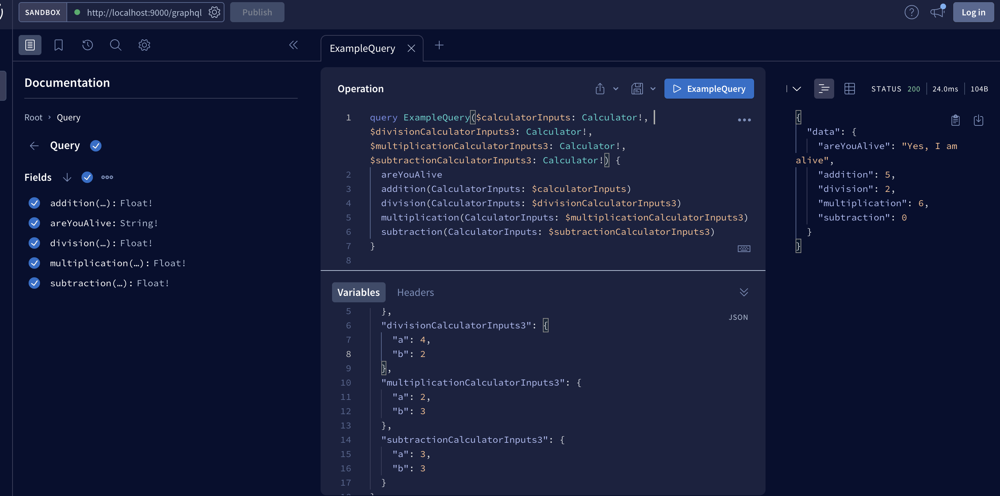

## GraphQL Calculator Service

This service provides a GraphQL API for performing mathematical operations.

Requirements

- Node.js 10+
- npm 6+

### Installation

Clone this repository and install the dependencies:

```bash
git clone https://github.com/Vectormike/calculator.git
cd calculator-service
npm install
```

### Running the server

```
npm start
```

To run in development:

```
npm run dev
```

The server will be running at http://localhost:9000/

Sandbox: [http://localhost:9000/graphql]()

### Usage

To use the service, you can send GraphQL queries and mutations to the /graphql endpoint using a tool like cURL or the [GraphQL Playground](https://github.com/graphql/graphql-playground).

API
The API exposes the following GraphQL queries:

- `addition(a: Float!, b: Float!): Float!`: Performs the addition of two numbers.

- `subtraction(a: Float!, b: Int!): Float!`: Performs the subtraction of two numbers.

- `multiplication(a: Float!, b: Float!): Float!`: Performs the multiplication of two numbers.

- `division(a: Float!, b: Float!): Float!`: Performs the division of two numbers.

### Examples

```
query {
  addition(a: 2, b: 3)
}
```

```
{
  "data": {
    "addition": 5
  }
}
```

```
query {
  subtraction(a: 5, b: 3)
}
```

```
{
  "data": {
    "subtraction": 2
  }
}
```

```
query {
  multiplication(a: 5, b: 3)
}
```

```
{
  "data": {
    "multiplication": 15
  }
}
```

```
query {
  division(a: 6, b: 3)
}
```

```
{
  "data": {
    "division": 2
  }
}
```

### Testing

To run the tests:

```
npm test
```

### Sample Query

Below is a sample query from sandbox


